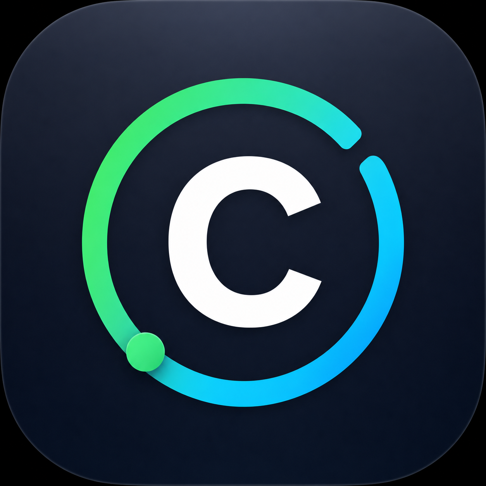

# Codex Status for macOS

Codex Status is a lightweight macOS menu bar utility that shows your real Codex quota windows and current task activity using local session metadata.



## Features

- Shows both quota windows at a glance: `5H 68% · 7D 69%`
- Color-coded healthy, warning, critical, and unavailable states
- Displays Idle, Working, Completed, and Error task states
- Detailed popover with reset times and account status
- Native Settings window for display, refresh, and login options
- Uses the official Codex sign-in flow
- Reads local metadata only and never exports prompts, responses, tokens, API keys, or passwords
- Notch-safe menu bar capsule on modern Mac displays

## Requirements

- macOS 13 or later
- Swift 6 toolchain
- Codex or the ChatGPT desktop app installed for account sign-in

## Build and Run

Build the signed local app bundle:

```bash
./scripts/build-app.sh
open "dist/Codex Status.app"
```

Build, stop any previous instance, launch, and verify exactly one process:

```bash
./script/build_and_run.sh --verify
```

## Settings

Open Settings from the gear button in the popover. Available options include:

- Menu bar format: icon and percentages, percentages only, or icon only
- Quota colors and critical threshold
- Task status indicator
- Refresh interval: 15, 30, or 60 seconds
- Launch at macOS login
- Codex account status and official sign-in

## Colors

- Green: more than 50% remaining
- Yellow: 20–50% remaining
- Red: below the configured critical threshold
- Gray and `—`: no verified quota data is available

## Data and Privacy

The app reads only these local event metadata types from `~/.codex/sessions/**/*.jsonl`:

- `token_count`
- `task_started`
- `task_complete`
- `task_failed`
- `turn_aborted`
- `error`

Quota remaining is calculated as `100 - used_percent`. The app does not display, log, or transmit prompt content, response content, access tokens, API keys, or credentials.

## Verification

```bash
swift run CodexStatusTests
swift build
./scripts/build-app.sh
./scripts/test-launch.sh
./scripts/test-menubar-overlay.sh
```

## License

MIT
